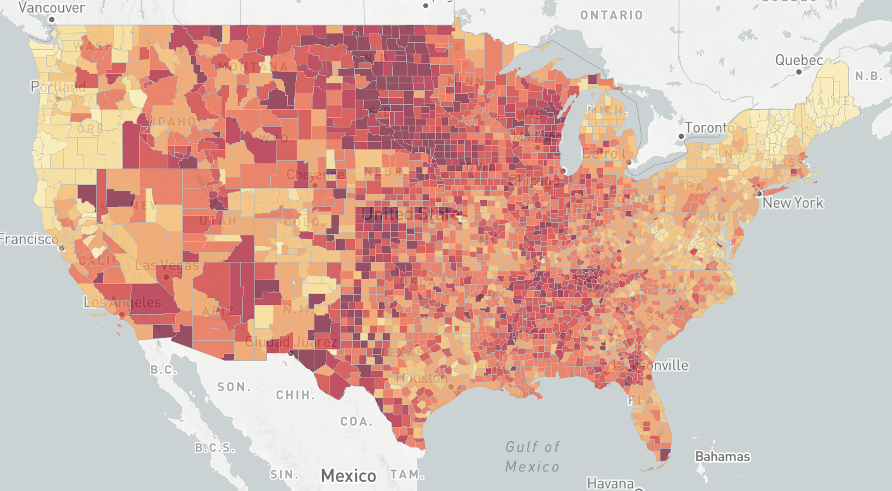
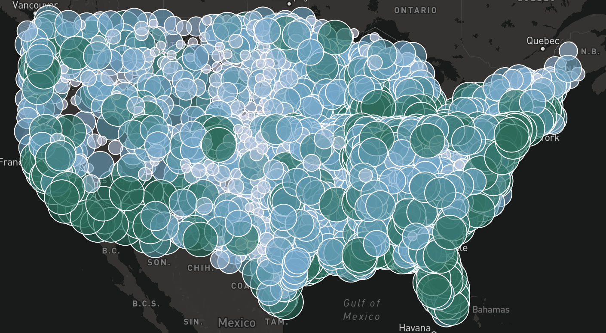

# Lab 3: Covid Web Maps

For Lab 3, I have visualized some very important covid-19 data in two seperate maps. The first map I created was a choropleth map of the rate of Covid-19 in every county. This map is linked 
[here](https://jduffy8.github.io/covid_web_maps/map1.html).

This map's main function is showing the rate data at a glance. Furthermore, the map always has the an interactive function. Whenever a user hovers over a county, the rate information is displayed on the screen as well as the name. This allows users to find their specific county and the ones around them.

For the second map, I have created a proportional symbols map that is focused on the pure amount of covid cases in a county. That map can be found [here](https://jduffy8.github.io/covid_web_maps/map2.html).

With this map, the primary goal was to visualize the covid cases with a proportional symbol that is styled based on the amount of cases. I have opted for a blue green color scheme that is much clearer to the client when they look on a closer scale at a more county level. Also, this map will display the amount of cases in a county when the symbol is clicked on by the user.